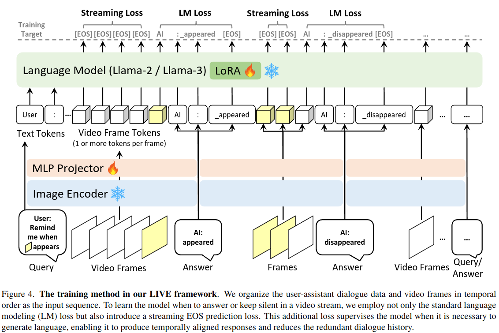

# VideoLLM-online: Online Video Large Language Model for Streaming Video

### Abstract

>최근의 대형 언어 모델(LLM)은 시각적 이해 능력을 강화하여 이미지, 비디오, 시각-언어가 혼합된 콘텐츠를 이해할 수 있게 되었습니다. 그러나 대부분의 멀티모달 모델은 비디오를 사전 정의된 클립으로 처리하기 때문에 스트리밍 비디오 입력을 효율적으로 처리하지 못하는 한계가 있습니다.
이 논문에서는 연속적인 비디오 스트림에서 시간적으로 정렬되고(long-context) 실시간 대화를 가능하게 하는 LIVE (Learning-In-Video-Stream) 프레임워크를 제안합니다. 이 프레임워크는 비디오 스트리밍 대화를 구현하기 위해 다음과 같은 방법들을 포함합니다: 
>1. 스트리밍 입력에 대한 언어 모델링을 수행하는 학습 목표
>2. 오프라인 시간 주석을 스트리밍 대화 형식으로 변환하는 데이터 생성 방식
>3. 실세계 비디오 스트림에서 모델 응답을 가속화하는 최적화된 추론 파이프라인
LIVE 프레임워크를 사용하여 Llama-2 및 Llama-3을 기반으로 VideoLLM-online 모델을 구축했으며, 스트리밍 비디오를 처리하는 데 있어 뛰어난 성능을 입증했습니다.

# 1. Introduction

다양한 상황에서 인간에게 적극적으로 도움을 줄 수 있는, 입력을 episodic memory로 digitize하고, 온라인의 연속적인 환경에서 predict를 할 수 있는, always-on, contextual AI assistant를 구축하는 것은 AI연구에서 중요한 임무 중 하나이다.
LLM의 발전에 따라 LMM또한 발전되어 왔고, vision-language dialogue, spatial understanding, processing diver modalities 등의 분야에서의 능력이 입증된 바 있다.
OpenAI의 GPT-4V나 GPT-4o는 특히 다재다능한 AI assistant가 되어가고 있다.
하지만, 가장 발전된 GPT-4o조차도 streaming voice기반의 multimodal assitance에 그쳤다.
이제는 video stream 내에서 자유 형식의 user-assistant 대화를 지원하는, always on, contextual인 J.A.R.V.I.S와 같은 비디오 비서를 구상해야 할 때이며, 이를 "Video Streaming Dialogue"라는 용어로 부르겠다.
기존의 offline이며, short-video clip에서만 작동하는 video understanding을 위한 LMM들과 달리, online assistant는 계속해서 refresh되는 연속적인 video frame을 받아야 한다.

이는 새로운 과제를 제시한다.

1. User query가 **temporally aligned**되어야 하며, 따라서 VideoLLM은 event를 놓치지 않기 위해 video-level의 응답을 하는 것이 아닌, 매 frame을 scan해야 한다.
2. Summarization, planning의 질문에 대해 응답하기 위해 VideoLLLM은 **long-context**한 과거의 시각과 언어를 유지해야 한다. 이는 LLM context window의 최대 창을 넘어버릴 수 있고, causal decoding 속도와 GPU 메모리에 부담이 된다.
3. VideoLLM은 응답을 **real-time**으로 생성해야 하며, 시나리오 안에서 항상 켜져(always-on) 있어야 한다.

기존의 Vision language 모델에서 영감을 얻은 온라인 VideoLLM 개발의 한 가지 가능성은 video stream 내에서 프레임별 채팅을 달성하기 위해 multi-turn dialogue 형식을 사용하는 것이다.
이는 각 타임스탬프에서 visual frame을 query로 활용하여 매우 빈번한 사용자 상호작용을 유도함으로써 달성할 수 있다.
우리는 이를 GPT-4V에 대한 프롬프트 엔지니어링에 사용했지만, 결과가 좋지 않았다.
GPT-4V는 각 프레임마다 길이가 긴 내용을 출력하는 경향이 있어 상당한 지연이 발생하며, 실시간 스트리밍 비디오에는 맞지 않았다.
우리는 또한 프레임별 채팅을 위한 baseline model을 훈련하는 것도 시도했지만, 이 접근 방식은 많은 중복된 프레임에서 유해한 언어 모델링이 발생하여 언어 모델링 기능이 현저히 저하되었다.

이에 따라 우리는 Learning-In-Video-strEam (LIVE) 라는, online video assistant를 위한 학습, 데이터, 추론 method들이 포함된 종합 Framework를 제안한다.
Per-frame dialogue approach와 달리 LIVE는 Streaming EOS라는, 모델이 video stream에서 언제 대답하고 언제 조용해야 하는지를 학습할 수 있게 하는 training object를 사용한다.
EOS token은 input/output sequence에 나타나지 않기 때문에, next-token prediction과 다르다.
하지만 학습을 위한 autoregressive loss를 사용할 수 있다.
이러한 디자인은 불필요한 context를 줄이고, 긴 streaming video를 관리하는 것을 쉽게 한다.
그럼에도 불구하고, 학습에는 video stream에서의 user query들과 assistant response들이 필요하다.
이를 다루기 위해서, LIVE는 offline annotation으로부터 online dialogue들로 변환하는 streaming dialogue generation scheme을 사용한다.
Inference 효율을 높이기 위해, key-value caching을 사용하고, bottleneck을 방지하기 위한 fast visual encoding, slow language decoding을 사용한다.

LIVE framework를 통해, CLIP vision encoder와 Llama2/Llama-3 language model을 사용하여 간단한 VideoLLM online model을 구현한다.
Video streaming dialogue를 evaluate하기 위해 language perplexity metric과 2가지 새로운 metric을 사용하여 language modeling과 temporal responsiveness, streaming의 fluency를 평가한다.

VideoLLM online model은 3가지의 metric에서 높은 속도를 보이며, 적은 메모리로도 사용이 가능했다. 
또한 다른 short-term이나 long-term등과 같은 offline benchmark에서도 좋은 성능을 보였다.

# 3. Method

## 3.1 Video Streaming Dialogue

### Problem Formulation
현재의 LMM들은 다음과 같은 이유 때문에 복잡한 실시간 지원 시나리오를 처리하기에 충분하지 않다.

- **프레임 간 중복된 응답**: 모델이 각 프레임마다 대화를 수행하려고 할 때, 이전 프레임과 유사한 또는 동일한 응답이 반복될 수 있다.
- **제한된 컨텍스트 창**: 현재 모델은 10에서 50 프레임 정도의 제한된 범위 내에서만 컨텍스트를 유지할 수 있다. 이는 실시간 비디오 스트림의 복잡성을 충분히 반영하기 어렵게 만든다.
- **느린 속도**: 모델의 응답 속도가 느리기 때문에 실시간 스트리밍 상황에서 사용자가 요구하는 빠른 반응을 제공하기 어렵다.

본 논문에서는 "Video streaming dialogue"라는 문제를 정의하고, 

- 시간 t = $t_1$ 이전의 context sequence \[$Ctx^{t<t_1}$] : 과거의 비전-언어 콘텐츠를 포함하며, 여기에는 사용자의 이전 질의, 비디오 프레임, 그리고 어시스턴트의 응답 등이 포함될 수 있다.
- 현재 진행 중인 video stream \[$Frame^{{t_1} \leq t \leq t_2}$] : 시간 $t_1$부터 $t_2$까지의 연속적인 비디오 프레임

이 문제를 해결하기 위한 목표를 설정한다.


1. 현재 시간 ($t_2$)가 language modeling에 적합한지 결정한다.
2. $t_2$ 가 적합한 시점으로 결정되면, 다음과 같은 확률을 최대화하는 language modeling을 수행한다.
$$maxP([Txt_{i+1}^{t_2}​]∣[Ctx^{<t_1}],[Frame^{t1≤t≤t2}​],[Txt_{≤i}^{t_2​}])$$
\[$Txt^t_i$​]는 시간 $t$에서 $i$-번째 위치의 이상적인 언어 토큰을 나타낸다.
### Interleaved/Per-frame Dialogue are Suboptimal
Interleaved 또는 Per-frame Dialogue들은 비효율적이다.

**Interleaved vision-language Chatting**
	주어진 video frame sequnce사이에서 language modeling을 학습하는 방법.
	현재 video LLM들은 단순화된 이러한 방법을 사용하고 있으며, single 또는 multi turn의 language dialogue를 비디오 클립 입력 후에 수행하고 있다.
	Inference중에 사용하려면, 수동으로 시점 $t_1$과 $t_2$를 선택해야 하므로, video streaming dialogue라는 개념과 맞지 않다.

만약 더 자유로운 형태를 사용하고자 한다면, 다음과 같은 방법을 사용할 수 있다.

**Per-frame vision-language Chatting**
	각 frame ($t_1 \leq t \leq t_2$ 범위 내의 모든 frame)에서 다음과 같은 language modeling을 수행하는 방법.
	$$max P([Txt_{i+1}^t​]∣[Ctx^{<t1}],[Frame^t​],[Txt_{≤i}^t​])$$
	프레임마다 언어 모델링을 수행하는 방법이 가능하나, 이 경우 모든 프레임에 대해 느리고 반복적인  다 음 토큰 예측을 수행해야 한다. 이는 real-time 처리를 어렵게 만들고, 프레임 누락 및 언어 모델의 제한된 context 창과 GPU memory 관리 문제를 야기한다.
	

위에서 제시한 2가지 방법의 문제점을 해결하기 위해 대화 내용에 EOS 토큰을 추가하여 해결하고자 한다.
### Streaming EOS Prediction
간단한 EOS(End-of-Sequence) 토큰을 프레임 간 대화의 내용으로 사용하는 방식을 고려해 보았을 때, 이 접근법은 여전히 비효율적이다.
대화 프롬프트 템플릿 (예: \[INST], \[/INST]와 같은 토큰)들이 프레임마다 상당한 수의 토큰을 소비하며, 이러한 토큰이 언어 모델의 난이도를 크게 증가시킬 수 있기 때문이다.

이러한 문제를 해결하기 위해 "Streaming EOS"를 사용한다.

중요한 시점 $t_2$에서 일반적인 언어 모델링을 수행한다.
$$max P([Txt_{i+1}^{t_2}​]∣[Ctx^{<t_2}],[Frame^{t_2}​],[Txt_{≤i}^{t_2}​])$$
답변 생성에 필요하지 않은 시점 $t1≤t<t2$에 대해서는 모델이 EOS 토큰을 예측하도록 학습한다.$$max P(EOS∣[Ctxt<t],[Framet]),where t1≤t<t2$$
이를 통해 대화 턴을 "건너뛰고", 스트리밍 입력에 대해 언어를 디코딩할 적절한 시점을 결정하도록 모델을 학습한다.

Inference 중에는, 
- 프레임에서 EOS가 예측되면, 모델은 다음 프레임을 입력으로 받아들인다.
- EOS 토큰이 context에 추가되지 않음으로써, language modeling에 영향을 미치지 않도록 한다.
  -> 이 작업은 next token prediction과는 다르지만, autoregressive loss에는 영향을 미칠 수 있게 한다.

이 접근 방식에서는 EOS 토큰이 기존 언어 모델에서 사용되는 실제 EOS 토큰(e.g., `</s>`)에 국한되지 않는다. 대신 시스템 프롬프트에 명시된 경우 어떤 토큰이라도 사용 가능하며, 단순화를 위해 "Streaming EOS"라는 용어를 사용하는 것이다.

## 3.3 Model Training

### Model Architecture


모델은 다음과 같은 세 가지 주요 구성 요소로 이루어져 있다.

1. **이미지 인코더 (Image Encoder):**
    
    - CLIP ViT-L 인코더를 사용하여 비디오 프레임 임베딩을 추출합니다. 이 인코더는 DataComp1B 데이터셋에서 사전 훈련되었다.
    - 비디오 프레임 임베딩은 초당 2프레임(FPS)으로 추출된다.
    - 각 비디오 프레임 임베딩의 형태는 $(1+hp×wp)×c$ 이다. 여기서 $(1+hp×wp)$ 는 CLS 토큰과 average pool된 spatial 토큰을 의미한다.
    
1. **MLP 프로젝터 (MLP Projector):**
    
    - 이미지 인코더로부터 추출된 프레임 임베딩은 MLP 프로젝터를 통해 프레임 토큰으로 변환된다. 이는 LLaVA-1.5의 방식과 유사하다.
    
1. **언어 모델 (Language Model):**
    
    - 프레임 토큰은 언어 토큰과 함께 LLaMA-2-7B-Chat 또는 LLaMA-3-8B-Instruct 모델에 입력된다.
    - 모델의 모든 선형 계층에 LoRA 기법이 적용되어 효율적인 튜닝을 한다.

### Training Loss

이 모델의 학습 목표는 크게 두가지로 볼 수 있다.

1. Auto-regressive Language Modeling
	$$−\log{l}_{j+1}P_j^{[Txt_{j+1}]}$$
2. Streaming EOS Prediction
	$$-w \log{f_jP_j^{[EOS]}}$$

- $l_j$ : $j$ 번째 토큰이 language response token이면 1, 아니면 0
- $f_j$ : $j$ 번째 토큰이 frame의 마지막 토큰이면서, $l_{j+1} = 0$ 일 때 1 
	(응답이 필요한 경우가 아닌 프레임에 대해 EOS loss가 적용)
- $P_j^{[Txt_{j+1}]}$ : $j$ 번째 토큰의 언어 모델 헤드에서 출력된 $j+1$ 번째 텍스트 토큰의 확률
- $P_j^{[EOS]}$ : $j$ 번째 토큰에 대한 EOS 토큰의 확률
- $w$ : 균형 조정 인자. default = 1

두 가지의 loss함수를 w를 사용한 가중합으로 표현하여 모델의 최종 loss function을 구할 수 있다.

$$L=\frac{1}{N}\sum^N_{j=1}(−\log{l}_{j+1}P_j^{[Txt_{j+1}]} - w\log{f_jP_j^{[EOS]})}$$
## 3.4 Inference

### Probability Correction

모델이 EOS(End-of-Sequence) 토큰을 과도하게 예측하는 것을 방지하기 위해, 출력 확률을 보정하는 임계값 $\theta$ 를 도입한다.

- EOS 토큰이 다음 토큰으로 고려되지 않도록 하기 위해, $P^{[EOS]}_j < θ$일 때는 EOS를 선택하지 않는다.
- 실용적인 사용에서, $\theta$ 를 0.5에서 0.8 사이로 설정하면 임계값이 없는 경우보다 훨씬 더 나은 결과를 얻을 수 있다.

### Continuous Key-Value Cache

Inference 과정에서, 비디오는 기본적으로 초당 2프레임(FPS 2)으로 프레임별로 streaming됩니다. 모델은 현재 프레임을 입력으로 받아 실시간으로 token을 생성합니다.

- Key-Value Cache를 사용하여 token decoding을 가속화합니다. 이를 통해 생성된 token을 다음 frame에 수동으로 추가할 필요가 없다.
- 모델 훈련은 모델이 필요하지 않은 경우 응답을 출력하지 않도록 유도하므로, 이러한 지속적인 추론은 효율적이며 비디오 스트림 속도에 맞출 가능성을 제공한다.

### Parallelization of encoding and decoding

Video frame encoder는 CLIP ViT-L (307M)을 사용하며, 이는 7B/8B의 언어 모델에 비해 상당히 작다. 이러한 크기 차이는 속도 불일치를 초래할 수 있으며, 특히 언어 모델이 긴 문장을 디코딩할 때 프레임이 누락될 수 있다.

이를 해결하기 위해,
- Encoding과 Decoding 과정 병렬화 : 빠른 visual 인코더는 느린 language 모델을 기다릴 필요 없이 계속해서 비디오 프레임을 인코딩하고 이를 queue에 추가
- FIFO queue를 설정 : 언어 모델은 이전 프레임 디코딩을 완료하면 큐에서 프레임 토큰을 가져오고, 이를 통해 비디오 인코딩이 지연되지 않도록 한다.

## My Inference Results

## Json format

```json
{
	"video_path": "demo/assets/cooking.mp4",
	"frame_fps": 2,
	"conversation": [
		{
			"role": "user",
			"content": "(Video Time = 0.0s) User: Please narrate the video in real time.",
			"time": 0.0,
			"fps": 1.5757373570706183,
			"cost": 0.6346235275268555
		},
		{
			"role": "assistant",
			"content": "(Video Time = 0.0s) Assistant: You walk around the room.",
			"time": 0.0,
			"fps": 1.5757373570706183,
			"cost": 0.6346235275268555
		},
...,
	]
}

```

# Cooking


---

# Advertise


---

# Stopmotion

